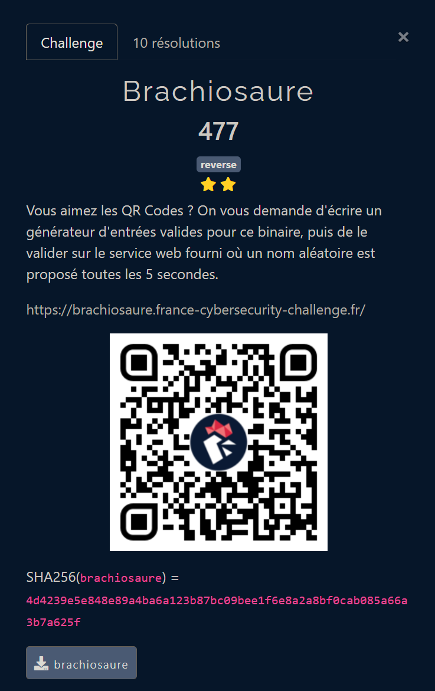
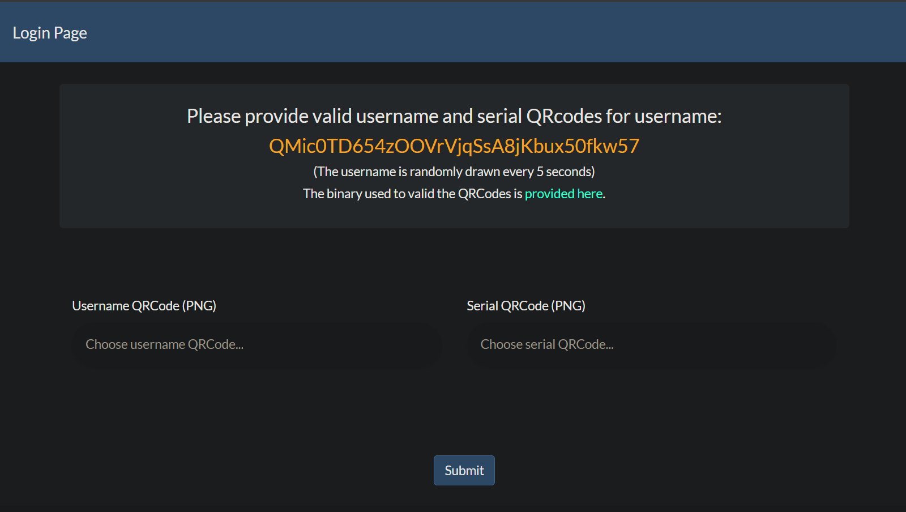
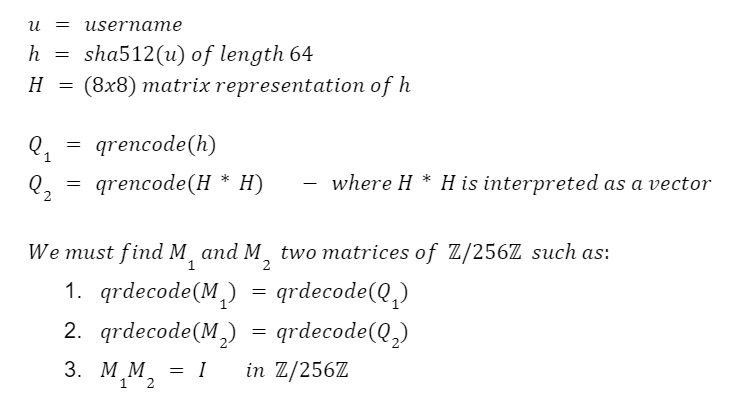
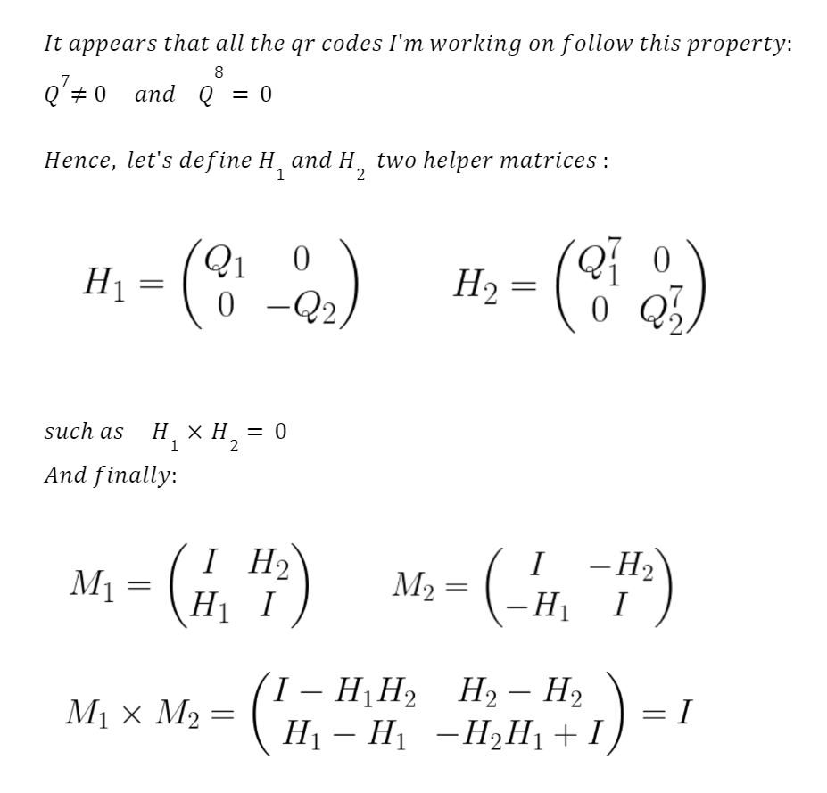

# Brachiosaure

## FCSC 2023 - Reverse



---

This challenge is the last one I worked on during the FCSC 2023. The reverse part is not really hard, but some complex maths are involved for the resolution. I'm assuming this is why it gets a difficulty of 2 stars.

### Overview

The challenge provides us a website and a binary.
The website greets us with a username, randomly picked each 5 seconds, and we must provide two valid qrcodes to login.

The binary is of course the one used to verify the qrcodes.

### Reversing the binary

Here are some useful information about the binary we are working with:

```
┌──(atxr㉿win)-[/mnt/c/Users/atxr/Desktop/FCSC-2023/rev-brachiosaure]
└─$ file brachiosaure

brachiosaure: ELF 64-bit LSB pie executable, x86-64, version 1 (SYSV), dynamically linked, interpreter /lib64/ld-linux-x86-64.so.2, BuildID[sha1]=3e4d225f1053b2a64de1cd133563e6e655049aca, for GNU/Linux 3.2.0, stripped

┌──(atxr㉿win)-[/mnt/c/Users/atxr/Desktop/FCSC-2023/rev-brachiosaure]
└─$ strings brachiosaure

zbar_image_create
[...]
png_set_strip_16
[...]
libzbar.so.0
libpng16.so.16
libcrypto.so.1.1
libc.so.6
[...]
SHA512_Final
[...]
Usage: %s <username> <username.png> <serial.png>
[...]

┌──(atxr㉿win)-[/mnt/c/Users/atxr/Desktop/FCSC-2023/rev-brachiosaure]
└─$ ldd brachiosaure

linux-vdso.so.1 (0x00007fffd83d5000)
libzbar.so.0 => /lib/x86_64-linux-gnu/libzbar.so.0 (0x00007f7bf4ad2000)
libpng16.so.16 => /lib/x86_64-linux-gnu/libpng16.so.16 (0x00007f7bf4a9c000)
libcrypto.so.1.1 => not found
libc.so.6 => /lib/x86_64-linux-gnu/libc.so.6 (0x00007f7bf48b0000)
libdbus-1.so.3 => /lib/x86_64-linux-gnu/libdbus-1.so.3 (0x00007f7bf4850000)
libv4l2.so.0 => /lib/x86_64-linux-gnu/libv4l2.so.0 (0x00007f7bf4830000)
libX11.so.6 => /lib/x86_64-linux-gnu/libX11.so.6 (0x00007f7bf46ee000)
libjpeg.so.62 => /lib/x86_64-linux-gnu/libjpeg.so.62 (0x00007f7bf465b000)
libz.so.1 => /lib/x86_64-linux-gnu/libz.so.1 (0x00007f7bf4630000)
libm.so.6 => /lib/x86_64-linux-gnu/libm.so.6 (0x00007f7bf4550000)
/lib64/ld-linux-x86-64.so.2 (0x00007f7bf4b22000)
libsystemd.so.0 => /lib/x86_64-linux-gnu/libsystemd.so.0 (0x00007f7bf4480000)
libv4lconvert.so.0 => /lib/x86_64-linux-gnu/libv4lconvert.so.0 (0x00007f7bf4400000)
libxcb.so.1 => /lib/x86_64-linux-gnu/libxcb.so.1 (0x00007f7bf43d0000)
libcap.so.2 => /lib/x86_64-linux-gnu/libcap.so.2 (0x00007f7bf4844000)
libgcrypt.so.20 => /lib/x86_64-linux-gnu/libgcrypt.so.20 (0x00007f7bf4280000)
liblzma.so.5 => /lib/x86_64-linux-gnu/liblzma.so.5 (0x00007f7bf4251000)
libzstd.so.1 => /lib/x86_64-linux-gnu/libzstd.so.1 (0x00007f7bf4180000)
liblz4.so.1 => /lib/x86_64-linux-gnu/liblz4.so.1 (0x00007f7bf4150000)
libXau.so.6 => /lib/x86_64-linux-gnu/libXau.so.6 (0x00007f7bf4140000)
libXdmcp.so.6 => /lib/x86_64-linux-gnu/libXdmcp.so.6 (0x00007f7bf3e00000)
libgpg-error.so.0 => /lib/x86_64-linux-gnu/libgpg-error.so.0 (0x00007f7bf4110000)
libbsd.so.0 => /lib/x86_64-linux-gnu/libbsd.so.0 (0x00007f7bf40e0000)
libmd.so.0 => /lib/x86_64-linux-gnu/libmd.so.0 (0x00007f7bf40d0000)

┌──(atxr㉿win)-[/mnt/c/Users/atxr/Desktop/FCSC-2023/rev-brachiosaure]
└─$ ./brachiosaure atxr random1.png random2.png

┌──(atxr㉿win)-[/mnt/c/Users/atxr/Desktop/FCSC-2023/rev-brachiosaure]
└─$ echo $?

1
```

In order to login successfully, we need an exit status of `0` instead of `1`.
Thanks to strings and ldd, we can spot that we will use the zbar and png libraries, probably to deal with the qrcodes, but also some cryptographic library to use `sha512`.

Let's dive into IDA! There were no technics used here to prevent use from reversing the binary, so it was quite straightforward. Here is a simplified version of the main function:

```c
void __fastcall __noreturn main(int argc, char **argv, char **env)
{
    int width1 = 0;
    unsigned int height1 = 0;
    unsigned int width2 = 0;
    unsigned int height2 = 0;
    char **image1 = 0;
    void *zbar1 = 0;
    char **image2 = 0;
    void *zbar2 = 0;
    char *product = 0;
    char data1[64];
    char data2[64];
    char hash[64];
    char ctx[272];

    if ( argc == 4 )
    {
        // hash the username
        strcpy(hash, argv[1]);
        SHA512_Init(ctx);
        size_t buffer_len = strlen(argv[1]);
        SHA512_Update(ctx, hash, buffer_len);
        SHA512_Final(hash, ctx);

        // decode the qrcodes with libzbar and libpng
        int ok1 = decode_qrcode(
                argv[2],  // username.png
                (char **)&image1,
                (unsigned int *)&width1,
                &height1,
                &zbar1,
                data1,
                64);
        int ok2 = decode_qrcode(
                argv[3],  // serial.png
                (char **)&image2,
                &width2,
                &height2,
                &zbar2,
                data2,
                64);

        if ( ok1 && ok2 )
        {
            // data1 is fixed = hash username
            int check_username = memcmp(hash, data1, 0x40uLL);

            // qrcodes must have the same shape
            bool check1 = check_username != 0  ||
                            width1 != height1  ||
                            height2 != height1 ||
                            width2 != width1;

            // data2 is fixed by data1
            bool check2 = check_data2(data1, data2, 8u) == 0;

            // check if image1 * image2 = I
            int check3 = check_inverse(image1, image2, &product, width1);

            free(image1);
            free(image2);
            free(product);
            int fail = check3 == 0 || check2 || check1;
            return 1;
        }
    }
    else
    {
        printf("Usage: %s <username> <username.png> <serial.png>\n", *argv);
    }
    return 1;
}
```

In order to return 0, the inputs must validate a bunch of tests:

1. Both must be valid qrcodes
2. Both qrcodes must be the same height/width
3. The first qrcode data must be `sha512(username)`
4. The second qrcode data must verify the `check_data2` function
5. Both images must validate the `check_inverse` function

### The `check_inverse` function

Here is the simplified version of the `check_inverse` function:

```c
bool __fastcall check_inverse(const char *A, const char *B, char **product, int size)
{
  const char *bj;
  bool sub_res;
  bool res = 0;

  if (!A)
    return 0;

  if (B)
  {
    int i = 0;
    *product = (char *)calloc(size * size, 1);
    res = true;
    while ( size > i )
    {
      int j = 0;
      do
      {
        bj = &B[j];
        int k = 0;
        char sum = 0;
        do
        {
          char c = *bj * A[i*size + k++];  // performed on a char ie modulo 256
          bj += size;
          sum += c;  // performed on a char ie modulo 256
        } while (size > k);

        (*product)[i16 + j] = sum;
        if (i == j)
          sub_res = sum == 1;

        else
          sub_res = sum == 0;

        ++j;
        res = sub_res & res;
      }
      while (size > j);
      ++i;
    }
  }
  return res;
}
```

In this function, if we interpret `a` and `b` as two `size*size` matrices, we can recognize a classic matrix product of `A*B`!
With this interpretation, the `res` boolean checks if the product is equal to one on the diagonal and 0 elsewhere.
Hence, this function computes the product `a*b` and checks if `a*b = I`.

> Note that all the products and sums are performed modulo 256, because variables are stored in `char`.

We can refine the 5th condition:

5. `image1 * image2 = I` (matrix product in `Z/256Z`)

### The `check_data2` function

Here is the simplified version of the `check_data2` function:

```c
int __fastcall check_data2(const char *data1, const char *data2, unsigned int size)
{
  char *product_1;
  char *product;

  product = 0;
  if ( !data1 || !data2 )
    return 0;

  int sqr_size = size * size;
  check_inverse(data1, data1, &product, size);  // product = data1 * data1
  int res = memcmp(data2, product, sqr_size) == 0;  // check if data2 = product = data1^2
  return res;
}
```

This function is simple to understand with the previous work on `check_inverse`. It performs the matrix product of `data1 * data1` and compares the result with the data decoded from the second qrcode.

Again, we can refine the 4th condition:

4. The second qrcode data must be the result of `data1 * data1` (matrix product in Z/256Z)

### The maths

With our five conditions, we can reformulate our problem with the following one:



At first sight, the problem looks hard because we need to conserve the validity of both qrcodes and ensure at the same time that the matrix product of both images is the identity in `Z/256Z`.

My approach to generate M1 and M2 was to create bigger images, that will embed Q1 and Q2 without altering them to ensure `1.` and `2.`, and then to add some data around to make `3.` valid.

At this point, I played a long time with the matrices of the qrcode, searching to invert them at the beginning (but of course there weren't invertible), then trying to add some data in the corner to make them invertible.
But I realized that even if I managed to make Q1 and Q2 invertible with some data around, I still need `Q2 = Q1^-1`, which is a strong constraint.
Of course, the invert of a matrix (when it exists) is just some garbage and cannot in any way be a valid qrcode.

And then after one day of work, I found a very interesting property.
It appears that all the qrcodes I was working on were nilpotent, ie none null matrix that becomes null after a given power.
From this property (that I will explain mathematically after), I did manage to generate a valid M1 and M2 like this:



---

The images M1 and M2 seems to be good candidates to validate the login for the binary!
Indeed, if we try to decode them as qrcode, the only valid qrcode in M1 is in Q1, which is embed in the bottom left in H1.
For M2, the only valid qrcode is Q2, inside -H1 in the bottom left also.

### More maths :)

You may wonder why are these qrcode nilpotent? I figured out thanks to the help of the FCSC discord at the end of the event.
Actually, each qrcode is encoded with a `box_size`, which represent the size of the boxes that will encode the information.
The higher this size is, the better the pixel quality will be the qrcode.

Therefore, the image will be composed of sub-matrices of size `box_size`, filled with either 0 or 255.
In practice, I worked with `box_size = 2`, which is the minimum size to get a correct qrcode quality.
Here is an example to illustrate my words:

```
This qrcode with a box_size of 2 would encode the data [1 1 ; 0 1] as:
| 255  255  255  255 |
| 255  255  255  255 |
|  0    0   255  255 |
|  0    0   255  255 |
```

With this, when performing a matrix multiplication of two qrcodes, we can ensure that the result will be a multiple of `box_size`!
Indeed, each sub-multiplication of sub-matrices will give either 0 or `box_size`.

```
Q x Q = box_size * R

And with box_size = 2,
Q^2 = 2 R
Q^16 = 256 R^8 = 0   (modulo 256)
```

Hence, we can ensure that at least Q^16 must be null with a `size_box` of 2.
In practice, we often have Q^8 = 0, and that's why I used 8 in the equation above.

Also, by changing the box_size to 3, we notice that the qrcode matrices are not niloptent anymore!

### Resolution

You will find in solve.py the code to generate the images M1 and M2 based on the username.
I also implemented a automated webscrapper that fetches the usernames, computes the valid qrcodes and submit them to the website in less than 5sec.
